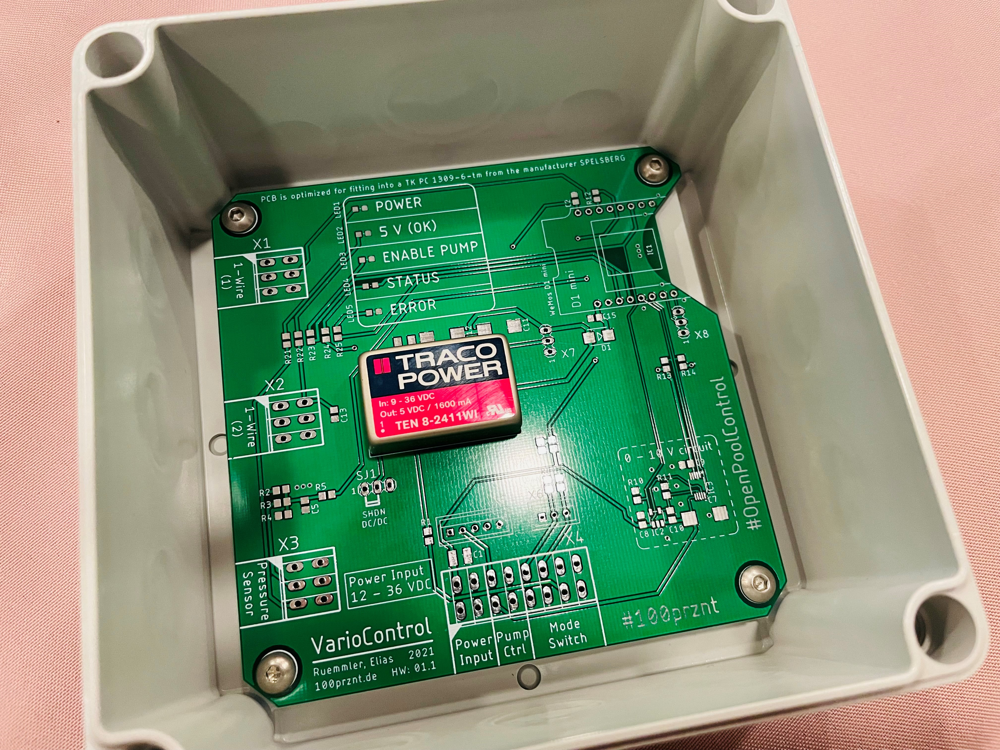
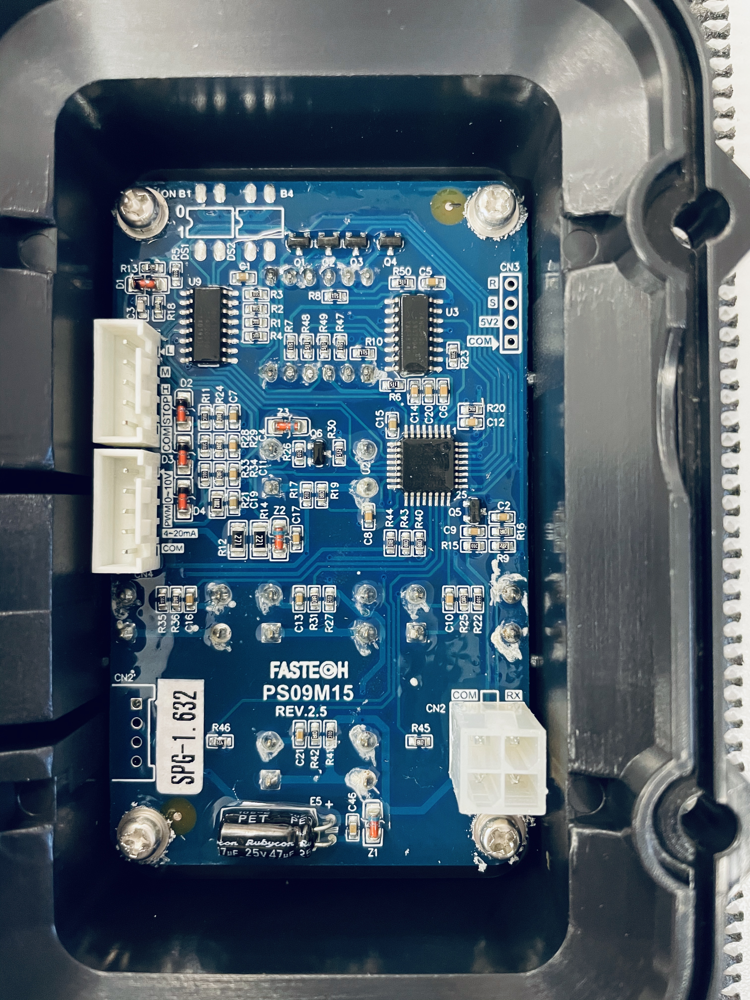
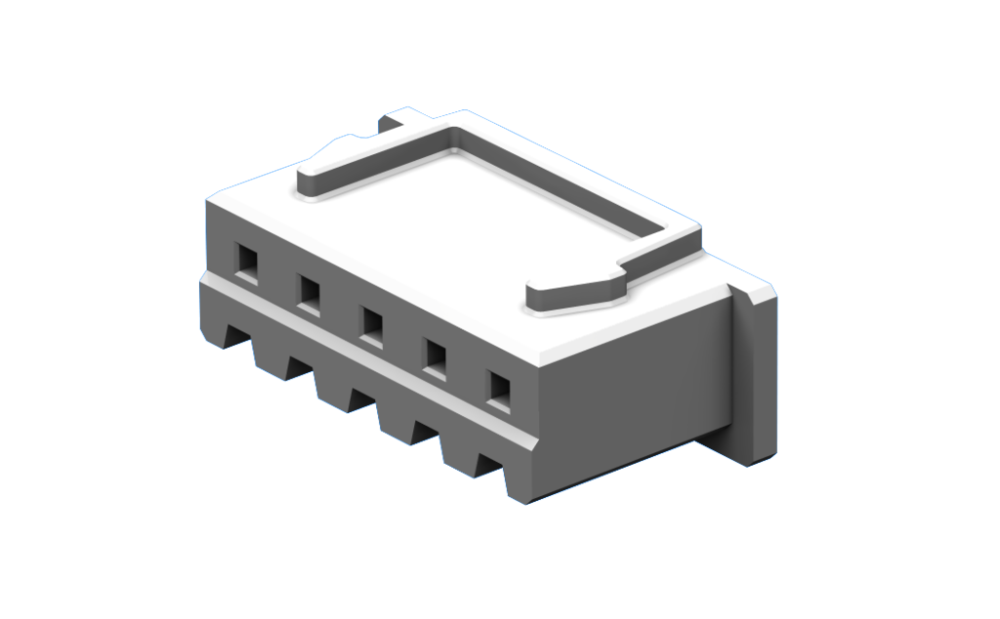

# VarioControl
IoT Pumpensteuerung für Vario Pumpen mit 0 – 10 V Schnittstelle.

------------

## Current build state

Unassembled PCB in matching Spelsberg enclosure.

## Hardware Features

+ 0 – 10 V Schnittstelle zur Drehzahlsteuerung einer Vario Pumpe
+ WiFi Schnittstelle
+ 1-wire Schnittstelle für zwei DS18B20 Temperatursensoren
+ 0 – 10 V Eingang für einen Drucksensor (alt. auch 0 – 5 V oder 4 - 20 mA möglich)
+ Schaltereingang zur Betriebsartvorwahl (AUTO – AUS – MANUELL)
+ 5 LEDs zur Zustandsvisualisierung
+ Weitbereichsspannungsversorgung (12 – 36 V)

## PCB

## AquaTechnix AquaVarioPlus

Control board of the AquaVarioPlus pump from AquaTechnix.

### Connector
The CN4 (pin 2) connector is provided for controlling the pump via the 0 - 10 V interface. 

#### Pinning

| pin# | function        | specification                    | in use with VarioControl |    
|------|-----------------|----------------------------------|--------------------------|
| 1    | n/a             |                                  | :heavy_multiplication_x: |
| 2    | rpm value (U)   | 0 - 10 V                         | :heavy_check_mark:       |
| 3    | PWM             | unknow specs?                    | :heavy_multiplication_x: |
| 4    | rpm value (I)   | 4 - 20 mA                        | :heavy_multiplication_x: |
| 5    | GND             |                                  | :heavy_check_mark:       |

#### Type
|              |                                      |
|--------------|--------------------------------------|
| Manufacturer | __JST (JAPAN SOLDERLESS TERMINALS)__ |
| SKU          | __XHP-5__                            |

Suitable contacts are listed in the data sheet on page 2.

* [Datasheet JST XH Connector](docu/jst-xh.pdf)

