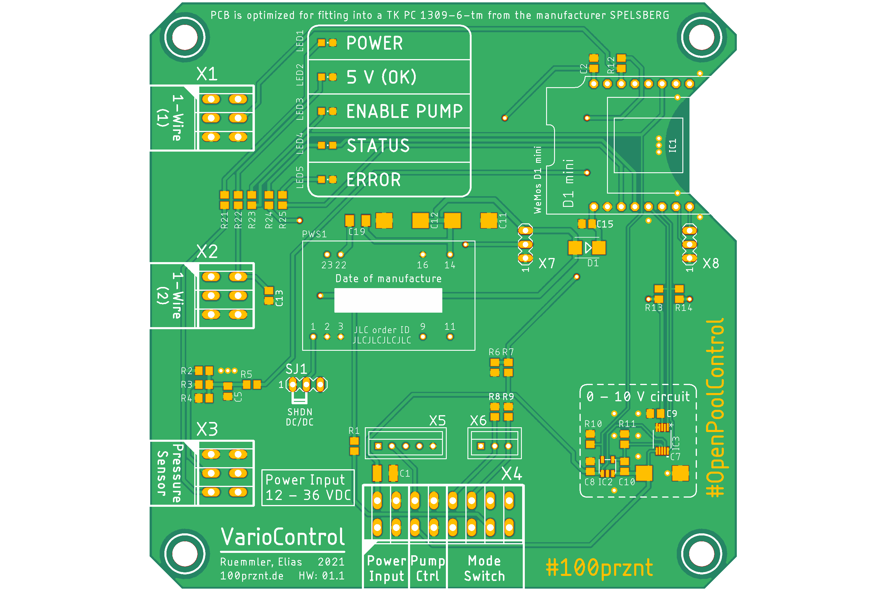
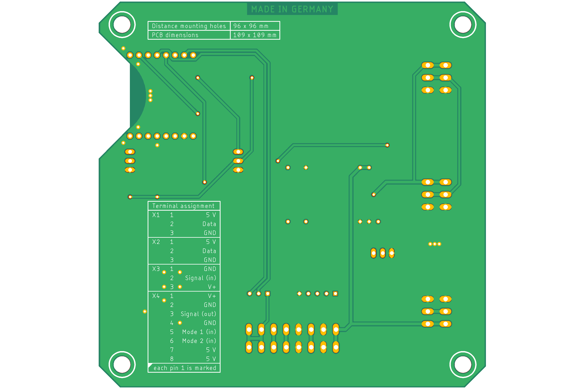

# VarioControl
IoT Pumpensteuerung für Vario Pumpen mit 0 – 10 V Schnittstelle.

------------

## Hardware Features

+ 0 – 10 V Schnittstelle zur Drehzahlsteuerung einer Vario Pumpe
+ WiFi Schnittstelle
+ 1-wire Schnittstelle für zwei DS18B20 Temperatursensoren
+ 0 – 10 V Eingang für einen Drucksensor (alt. auch 0 – 5 V möglich)
+ Schaltereingang zur Betriebsartvorwahl (AUTO – AUS – MANUELL)
+ 5 LEDs zur Zustandsvisualisierung
+ Weitbereichsspannungsversorgung (12 – 36 V)

## PCB

